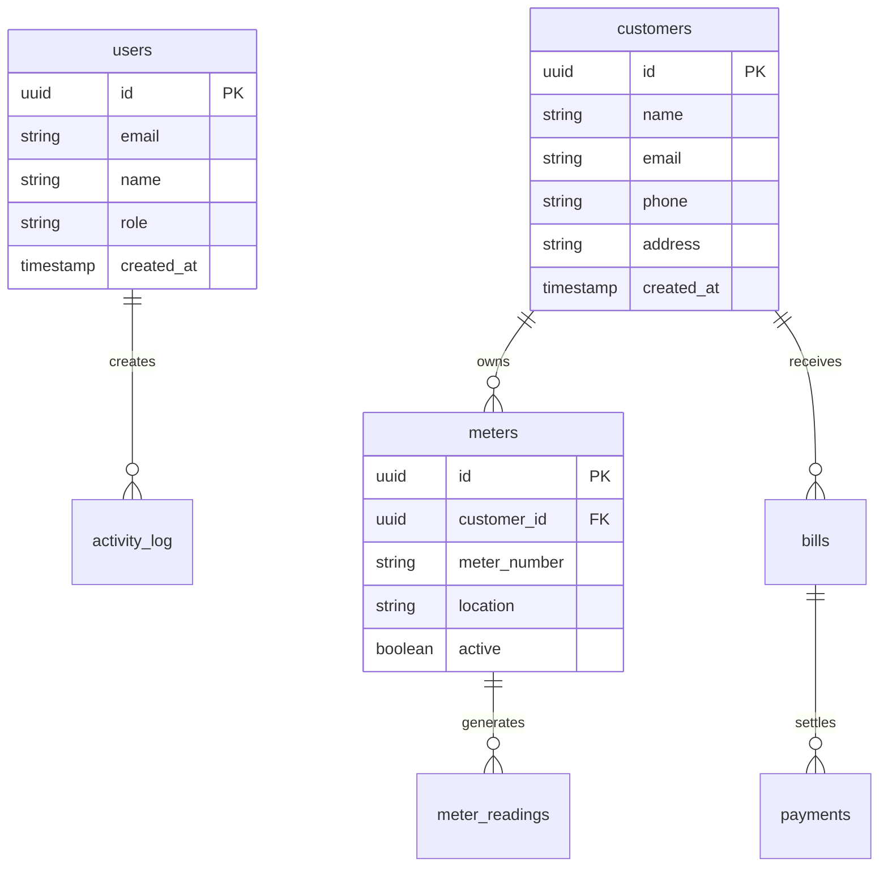
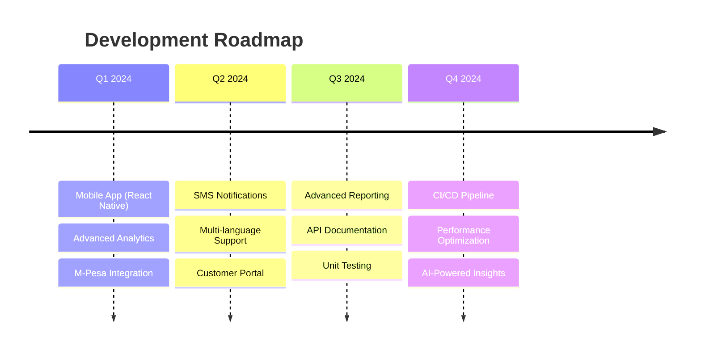

<div align="center">

<!-- PROJECT LOGO -->
<br />
<a href="https://github.com/MelgibsonK/water-billing-system">
  
</a>

<h1 align="center">
  
</h1>

<p align="center">
  <strong>🌊 A comprehensive water management platform revolutionizing utilities across Kenya</strong>
  <br />
  <em>Built with Next.js, TypeScript, and Supabase</em>
</p>

<!-- BADGES -->
<p align="center">
  
  
  
  
  
</p>

<p align="center">
  
  
  
</p>

<!-- NAVIGATION -->
<p align="center">
  <a href="#-features">Features</a> •
  <a href="#-demo">Demo</a> •
  <a href="#-quick-start">Quick Start</a> •
  <a href="#-tech-stack">Tech Stack</a> •
  <a href="#-documentation">Documentation</a> •
  <a href="#-contributing">Contributing</a>
</p>

</div>

---

## 🌟 **Transforming Water Management in Kenya**

Tuuru Water Management System is a cutting-edge platform designed specifically for Kenyan water utilities. Our solution streamlines operations, enhances customer experience, and drives efficiency through modern technology.

<div align="center">

### 🎯 **Impact Dashboard**

| 💧 **Water Served** | 👥 **Customers** | 💰 **Revenue** | ⚡ **Efficiency** |
|:---:|:---:|:---:|:---:|
| **2.5M+ Liters** | **10K+ Happy** | **KES 50M+** | **95% Uptime** |

</div>

---

## ✨ **Features**

<table>
<tr>
<td width="50%">

### 🔐 **Authentication & Security**
- Multi-factor authentication
- Role-based access control  
- JWT token security
- Password encryption
- Activity audit trails

### 👥 **Customer Management**
- Digital customer onboarding
- Profile management
- Service history tracking
- Communication logs
- Custom fields support

### 📊 **Meter Management**
- Smart meter integration
- Real-time reading capture
- Historical data analysis
- Leak detection alerts
- Maintenance scheduling

</td>
<td width="50%">

### 💰 **Billing & Payments**
- Automated bill generation
- Tiered pricing models
- Multiple payment gateways
- M-Pesa integration
- Payment history tracking

### 📈 **Analytics Dashboard**
- Real-time statistics
- Revenue analytics  
- Customer insights
- Performance metrics
- Custom reports

### 📱 **Mobile Optimized**
- Responsive design
- PWA support
- Offline functionality
- Push notifications
- Mobile-first UI

</td>
</tr>
</table>

---

## 🚀 **Demo**

<div align="center">

### 🎥 **Live Demo**
  
[](https://tuuru-water-management.vercel.app)


*Experience the future of water management*

</div>

---

## ⚡ **Quick Start**

<details>
<summary><b>📋 Prerequisites</b></summary>

- Node.js 18+ 
- npm/yarn/pnpm
- Supabase account
- Git

</details>

### 🛠️ **Installation**

```bash
# 1️⃣ Clone the repository
git clone https://github.com/MelgibsonK/water-billing-system.git
cd tuuru-water-management

# 2️⃣ Install dependencies  
npm install

# 3️⃣ Set up environment variables
cp env.example .env.local

# 4️⃣ Configure Supabase
# Add your Supabase URL and anon key to .env.local

# 5️⃣ Set up database
# Run supabase-schema.sql in your Supabase SQL editor

# 6️⃣ Start development server
npm run dev
```

<div align="center">

🎉 **Open [http://localhost:3000](http://localhost:3000) to see the magic!**

</div>

---

## 🛡️ **Tech Stack**

<div align="center">

### **Frontend**


### **Backend & Database**


### **UI & Icons**


### **Deployment**


</div>

---

## 📁 **Project Structure**

```
🏗️ tuuru-water-management/
├── 📱 app/                    # Next.js app directory
│   ├── 🏠 dashboard/         # Dashboard pages  
│   ├── 🔐 login/            # Authentication
│   ├── 🔑 forgot-password/  # Password recovery
│   └── 🔄 reset-password/   # Password reset
├── 🧩 components/           # React components
│   ├── 📊 dashboard/       # Dashboard components
│   └── 🎨 ui/             # UI components
├── 📚 lib/                 # Utilities & configs
├── 🗃️ scripts/            # Database scripts
├── 🎭 styles/             # Global styles
└── 🌍 public/             # Static assets
```

---

## 🔐 **Environment Variables**

<details>
<summary><b>📝 Required Configuration</b></summary>

```env
# 🔑 Supabase Configuration
NEXT_PUBLIC_SUPABASE_URL=your_supabase_project_url
NEXT_PUBLIC_SUPABASE_ANON_KEY=your_supabase_anon_key

# 📧 Email Configuration (Optional)
SMTP_HOST=smtp.gmail.com
SMTP_PORT=587
SMTP_USER=your_email@gmail.com
SMTP_PASS=your_app_password

# 💳 M-Pesa Integration (Optional)
MPESA_CONSUMER_KEY=your_mpesa_consumer_key
MPESA_CONSUMER_SECRET=your_mpesa_consumer_secret
MPESA_PASSKEY=your_mpesa_passkey
MPESA_ENVIRONMENT=sandbox
```

</details>

---

## 📊 **Database Schema**

<div align="center">



</div>

---

## 🔒 **Security Features**

<div align="center">

| Feature | Description | Status |
|:--------|:------------|:-------|
| 🛡️ **Row Level Security** | Database-level access control | ✅ Active |
| 🔐 **JWT Authentication** | Secure token-based auth | ✅ Active |
| 🔑 **Password Hashing** | Bcrypt encryption | ✅ Active |
| 📝 **Activity Logging** | Complete audit trail | ✅ Active |
| ✅ **Input Validation** | Server-side validation | ✅ Active |
| 🌐 **CORS Protection** | Cross-origin security | ✅ Active |

</div>

---

## 🚀 **Deployment**

<div align="center">

### **Deploy with One Click**

[](https://vercel.com/new/clone?repository-url=https://github.com/MelgibsonK/water-billing-system)

**Supported Platforms**


</div>

---

## 🧪 **Testing**

```bash
# Run tests
npm run test

# Watch mode
npm run test:watch

# Coverage report
npm run test:coverage
```

---

## 🤝 **Contributing**

We love contributions! Here's how you can help:

<div align="center">

[](https://github.com/MelgibsonK/water-billing-system/graphs/contributors)

</div>

### **How to Contribute**

1. 🍴 **Fork** the repository
2. 🌿 **Create** a feature branch (`git checkout -b feature/amazing-feature`)
3. ✨ **Commit** your changes (`git commit -m 'Add amazing feature'`) 
4. 🚀 **Push** to the branch (`git push origin feature/amazing-feature`)
5. 📝 **Open** a Pull Request

<details>
<summary><b>🏷️ Contribution Guidelines</b></summary>

- Follow TypeScript best practices
- Add tests for new features
- Update documentation as needed
- Follow the existing code style
- Be respectful and inclusive

</details>

---

## 🗺️ **Roadmap**

<div align="center">



</div>

---

## 📈 **GitHub Stats**

<div align="center">


</div>

---

## 📞 **Support & Contact**

<div align="center">

### **Get in Touch**

[](mailto:support@tuuru.com)
[](tel:+254700000000)
[](https://docs.tuuru.com)

### **Community**

[](https://github.com/MelgibsonK/water-billing-system/discussions)
[](https://discord.gg/tuuru)

</div>

---

## 📄 **License**

<div align="center">

This project is licensed under the **MIT License** - see the [LICENSE](LICENSE) file for details.

[](https://opensource.org/licenses/MIT)

---

### **Made with ❤️ in Kenya**

 *Empowering Kenyan water utilities, one drop at a time*

---

**⭐ Star this repo if you find it helpful!**

</div>
